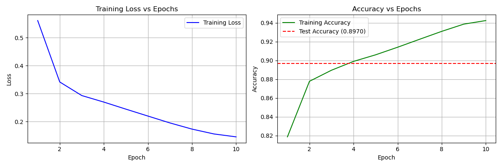
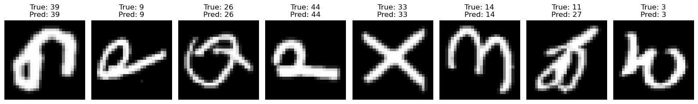
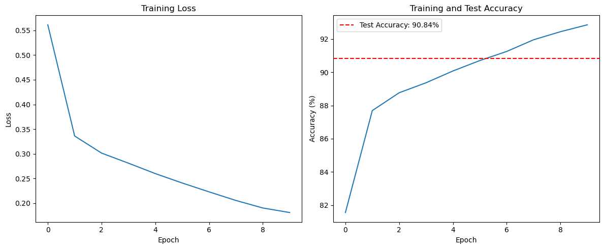
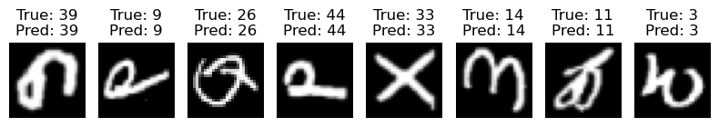

# Report of the First Assignment: Building a neural network model for classification problem

## 1 Dataset and Model Introduction

### 1.1 Dataset Introduction

The EMNIST Balanced dataset is an extension of the original MNIST dataset that includes both handwritten letters and digits. It contains 131,600 images evenly distributed across 47 classes—10 digits (0–9) and 37 uppercase and lowercase letters, excluding confusing pairs (like 'O' and '0'). Each image is 28×28 grayscale, and the dataset is designed for benchmarking character recognition models. The dataset is split into two parts: a training set with 112,800 images and a test set with 18,800 images. We will use the training set for training and 5-fold cross validation, and the test set for final evaluation. 

### 1.2 Model Introduction

We use the strategy provided in the assignment document to build up the model that obtains the best performance. We present the structure of the baseline model and the best performing model below:

  <!-- MLP 表格 -->
  

    <strong>MLP</strong>
    <table border="1" style="border-collapse: collapse; font-size: 10pt;">
      <tr><th>parameter</th><th>Baseline</th><th>Best</th></tr>
      <tr><td>Hidden layers</td><td>3</td><td>3</td></tr>
      <tr><td>Neurons/layer</td><td>128</td><td>128</td></tr>
      <tr><td>Learning rate scheduler</td><td>None (lr=0.1)</td><td>StepLR (init=0.1, step=10, γ=0.5)</td></tr>
      <tr><td>Activation function</td><td>ReLU</td><td>ELU</td></tr>
      <tr><td>Optimizer</td><td>Adam</td><td>SGD</td></tr>
      <tr><td>Batch normalization</td><td>True</td><td>True</td></tr>
      <tr><td>Regularization</td><td>L1 (1e-5)</td><td>L1 (1e-5)</td></tr>
      <tr><td>Dropout</td><td>[0.25, 0.25, 0.0]</td><td>[0.25, 0.25, 0.0]</td></tr>
    </table>
  

  <!-- CNN 表格 -->
  

    <strong>CNN</strong>
    <table border="1" style="border-collapse: collapse; font-size: 10pt;">
      <tr><th>parameter</th><th>Baseline</th><th>Best</th></tr>
      <tr><td>Convolutional layers</td><td>2</td><td>3</td></tr>
      <tr><td>Filters</td><td>[32, 64]</td><td>[32, 64, 128]</td></tr>
      <tr><td>Kernel size</td><td>3×3</td><td>5×5×3</td></tr>
      <tr><td>Learning rate scheduler</td><td>CosineAnnealingLR
 </td><td>CosineAnnealingLR</td></tr>
      <tr><td>Activation function</td><td>ReLU</td><td>LeakyReLU</td></tr>
      <tr><td>Optimizer</td><td>Adam</td><td>Adam</td></tr>
      <tr><td>Batch normalization</td><td>True</td><td>True</td></tr>
      <tr><td>Regularization</td><td>None</td><td>None</td></tr>
      <tr><td>Dropout</td><td>0.5</td><td>0.0</td></tr>
    </table>
  

  <!-- ResNet 表格 -->
  

    <strong>ResNet</strong>
    <table border="1" style="border-collapse: collapse; font-size: 10pt;">
      <tr><th>parameter</th><th>Baseline</th><th>Best</th></tr>
      <tr><td>Residual blocks</td><td>[2,2,2]</td><td>[2,2,2]</td></tr>
      <tr><td>Filters</td><td>[64, 128, 256]</td><td>[64, 128, 256]</td></tr>
      <tr><td>Learning rate scheduler</td><td>CosineAnnealingLR</td><td>CosineAnnealingLR</td></tr>
      <tr><td>Activation function</td><td>LeakyReLU</td><td>LeakyReLU</td></tr>
      <tr><td>Optimizer</td><td>Adam</td><td>Adam</td></tr>
      <tr><td>Batch normalization</td><td>True</td><td>True</td></tr>
      <tr><td>Regularization</td><td>None</td><td>None</td></tr>
      <tr><td>Dropout</td><td>0.0</td><td>0.0</td></tr>
    </table>
  

## 2 The Rationale of the Design on MLP, CNN, and ResNet

### 2.1 MLP

#### Hyper parameters and Techniques

The hyper parameters and techniques we choose to tune and explore are as follows: Number of hidden layers: 3, 4, 5; Number of neurons in each hidden layer: 32, 64, 128; Learning rate scheduler: None, StepLR, ReduceLROnPlateau; Activation function: ReLU, ELU, LeakyReLU; Optimizer: Adam, SGD, RMSprop; Batch normalization: True, False; Regularization: L1, L2, None; Dropout: True, False; Data Augmentation: True, False

These hyper parameters and techniques were selected because they are commonly used to control the capacity, convergence behavior, generalization ability, and regularization of neural networks. They directly influence how well a model learns from training data and generalizes to unseen data. By systematically varying each, we aimed to find a well-balanced configuration for optimal performance on the EMNIST dataset.

#### Effect and analysis of each hyperparameter or technique

1. **Number of Neurons in Each Hidden Layer**  
   Increasing the number of neurons from 32 to 128 led to better training and test accuracy. A larger number of neurons enhances the model’s capacity to learn complex patterns, boosting performance.

2. **Number of Hidden Layers**  
   More layers resulted in lower accuracy. Deeper networks face optimization challenges like vanishing gradients, which can lead to underfitting or poor convergence. A 3-layer network was found to be sufficient.

3. **Learning Rate Scheduler**  
   Using schedulers like StepLR or ReduceLROnPlateau significantly improved performance.StepLR, in particular, helped by allowing large updates early in training and fine-tuning later, leading to better convergence and higher final accuracy.

4. **Activation Function**  
   ELU slightly outperformed ReLU and LeakyReLU. ELU provides smoother gradients for negative inputs, which can improve learning stability and performance.

5. **Optimizer**  
   SGD performed better than Adam and RMSprop in terms of generalization. While Adam converges quickly, SGD with StepLR yielded better validation and test accuracy, likely due to its better generalization properties.

6. **Batch Normalization**  
   Enabled better accuracy across the board. It stabilizes and accelerates training by reducing internal covariate shift, leading to improved generalization.

7. **Regularization**  
   L1 regularization slightly outperformed L2 and no regularization. L1 helps enforce sparsity in weights, which can reduce overfitting and improve generalization.

8. **Dropout**  
   Improved validation and test accuracy by preventing overfitting. Even though training accuracy dropped, dropout forced the model to learn more robust features.

9. **Data Augmentation**  
   Surprisingly, it did not improve performance. The applied augmentation may have been too aggressive, increasing difficulty in learning without enough benefit, thus slightly hurting accuracy.

### 2.2 CNN

#### Hyper parameters and Techniques
The hyperparameters and techniques we choose to tune and explore for the CNN model are as follows:Conv. layers: [32, 64], [32, 64, 128]; Kernel size: [3, 3], [5, 3], [3, 3, 3], [5, 5, 3] , [5, 3, 3];Learning rate scheduler: StepLR, CosineAnnealingLR;Activation function: ReLU, ELU, LeakyReLU(0.1); Optimizer: Adam, SGD, RMSprop;Batch normalization: True, False;Regularization: L1, L2, None;Dropout: True(0.5), False.

#### Effect and analysis of each hyperparameter or technique

1. **Convolutional Layers with Different Channels**  
   Increasing the number of convolutional layers and channels significantly improves the model’s feature learning capacity. Expanding from two layers \[32, 64] to three layers \[32, 64, 128] raises test accuracy from 86.99% to 88.77%. This indicates that a deeper architecture captures more complex, hierarchical features. However, the modest 0.19% gain suggests that the two-layer model already captures most relevant patterns.

2. **Kernel Size**  
   Larger kernel sizes, particularly in the early layers, result in better performance. The configuration \[5, 5, 3] achieves the highest accuracy of 89.22%, outperforming the standard \[3, 3, 3] setup. Using 5×5 kernels in early layers helps detect larger-scale patterns, while a 3×3 kernel in the final layer captures finer details—leading to improved feature extraction and classification.

3. **Activation Function**  
   LeakyReLU outperforms both ReLU and ELU, achieving the highest test accuracy at 89.63%. Its small negative slope prevents the “dying ReLU” problem by allowing gradient flow for negative inputs. ELU follows closely, benefiting from smoother gradients, though at a higher computational cost. ReLU performs the weakest among the three but remains competitive.

4. **Optimizer**  
   While Adam and RMSprop achieve solid accuracy (89.63% and 89.52% respectively), SGD falls behind at 77.50%. This aligns with results from MLP experiments, where Adam’s fast convergence is offset by weaker generalization. Although not reflected here, with proper learning rate scheduling, SGD can outperform adaptive optimizers in terms of generalization.

5. **Learning Rate Scheduler**  
   CosineAnnealingLR outperforms StepLR by providing a smoother decay in the learning rate, boosting test accuracy from 89.41% to 89.63%. The cosine schedule helps the model escape local minima and converge more effectively by gradually reducing the learning rate with periodic restarts.

6. **Batch Normalization**  
   Adding batch normalization leads to slight improvements in accuracy, from 89.56% to 89.63%. By normalizing inputs across mini-batches, it reduces internal covariate shift, stabilizes training, and allows the use of higher learning rates—resulting in faster convergence and improved generalization.

7. **Dropout**  
   Dropout (rate = 0.5) slightly decreases performance in this case, reducing test accuracy from 89.70% to 89.63%. This suggests that the model already benefits from sufficient regularization through batch normalization, and adding dropout may unnecessarily reduce model capacity without providing additional gains.

8. **Regularization**  
   No regularization yields the highest test accuracy (89.70%), outperforming both L1 (89.45%) and L2 (89.40%) regularization. This implies that the architectural design and batch normalization already provide adequate regularization. Additional penalties on weights might restrict learning capacity and hurt performance.

### 2.3 Resnet

#### Hyper parameters and Techniques

The hyperparameters and techniques we choose to tune and explore for the ResNet model are as follows:Number of residual blocks: [2, 2, 2], [3, 3, 3], [1, 2, 3], Learning rate scheduler: None, StepLR, ReduceLROnPlateau, Activation function: ReLU, ELU, LeakyReLU,Optimizer: Adam, SGD, RMSprop, Batch normalization: True, False, Regularization: L1, L2, None, Dropout: True, False, Data Augmentation: True, False

We fix the conv-kernel size to `5` as we obtained in the `CNN` model.

#### Effect and analysis of each hyperparameter or technique

1. **Number of Residual Blocks**  
   The architecture with residual blocks arranged as \[2, 2, 2] achieves the highest test accuracy of 0.9084. This balanced structure provides adequate model capacity while avoiding overfitting. The deeper \[3, 3, 3] architecture does not yield further improvement, suggesting diminishing returns with increased depth. Meanwhile, the asymmetric \[1, 2, 3] architecture performs slightly worse (0.9065), likely due to imbalanced feature representation across stages.

2. **Activation Function**  
   LeakyReLU achieves the best performance with a test accuracy of 0.9084. Its ability to allow small negative outputs helps prevent the "dying ReLU" problem while maintaining efficiency. ReLU performs reasonably well (0.9060), while ELU trails behind at 0.9044, possibly because its more complex computations do not yield additional benefits in this setting.

3. **Optimizer**  
   Adam significantly outperforms the other optimizers with a test accuracy of 0.9084. Its adaptive learning rates and built-in momentum facilitate faster convergence and better solutions. RMSprop follows closely at 0.9069, benefiting from per-parameter updates. SGD performs poorly (0.3147), likely due to difficulties in optimizing the complex architecture with a fixed learning rate and no momentum.

4. **Learning Rate Scheduler**  
   CosineAnnealingLR slightly outperforms StepLR, achieving a test accuracy of 0.9084 versus 0.9078. The cosine-based learning rate schedule offers smoother decay and better convergence behavior, helping the model navigate the loss landscape more effectively and avoid poor local minima.

5. **Batch Normalization**  
   Using batch normalization dramatically improves performance. With batch normalization, the test accuracy reaches 0.9084, compared to only 0.1315 without it. This highlights its critical role in stabilizing training, reducing internal covariate shift, and improving both convergence speed and generalization.

6. **Regularization**  
   No regularization yields the best performance (0.9084), followed by L2 (0.9078) and L1 (0.8913). This suggests that the model already benefits from built-in regularization mechanisms like batch normalization, making additional weight decay either unnecessary or even detrimental.

7. **Dropout**  
   Disabling dropout results in slightly better accuracy (0.9084) than enabling it (0.9072). This implies that existing regularization techniques—especially batch normalization—are sufficient, and dropout may slightly hinder the model’s ability to learn by reducing its effective capacity.

## 3 Results 

### 3.1 MLP
The result for each fold in 5-fold cross validation is similar, so we only show the result of the first fold.
#### 3.1.1 training loss, testing loss and testing accuracy

The accuracy of the best model on test set is 0.8614

  
  

We can see that the loss of the training set dropped rapidly in the first few rounds and then stabilized, indicating that the model has converged. The loss of the test set also dropped rapidly in the first few rounds and then stabilized, indicating that the model is not overfitting. The accuracy of the optimal model we obtained using the early stopping method on the test set is 0.8614, indicating that the model has good generalization ability. And we found that the loss of the training set is always higher than the loss of the test set. This is because we use dropout and batch normalization techniques to prevent overfitting, which will cause the model to not fully exert its capabilities during training, resulting in the loss of the training set being higher than the loss of the test set.

#### 3.1.2 The predicted results of the best model on test set

As can be seen from the figure above, the model's prediction results on the test set are relatively good. It can accurately predict most of the letters and numbers. However, for some similar letters and numbers, such as '9' and 'q', the model's prediction results are wrong. This is because these two letters and numbers are very similar in shape, and it is difficult for the model to distinguish them. This is also reasonable.

### 3.2 CNN

#### 3.2.1 training loss, training accuracy and testing accuracy

The training loss decreases rapidly and then gradually over epochs, indicating effective learning and convergence. Training accuracy steadily increases, while the test accuracy remains stable and close to the training accuracy, suggesting good generalization and no significant overfitting. The final test accuracy reaches approximately 89.7%, demonstrating strong model performance on unseen data.

#### 3.2.2 The predicted results of the best model on test set

The sample predictions show that the model correctly classifies most handwritten characters, as the predicted labels match the true labels in most cases. However, there are occasional misclassifications, which may occur for characters with similar shapes or ambiguous handwriting. Overall, the model demonstrates strong recognition ability on the test samples.

### 3.3 ResNet
The result for each fold in 5-fold cross validation is similar, so we only show the result over all data. (average validation accuracy = 90.62%, baseline value = 90.84%).

#### 3.3.1 training loss, testing loss and testing accuracy

The training loss decreases steadily over epochs, indicating effective learning and convergence. Training accuracy improves consistently, and the test accuracy (90.84%) remains close to the training accuracy, suggesting good generalization and minimal overfitting. The model demonstrates strong performance and stability on both training and test data.

#### 3.3.2 The predicted results of the best model on test set

### 3.4 Comparison of MLP, CNN, and ResNet

From the performance results, ResNet clearly outperforms both CNN and MLP, achieving a test accuracy of 90.84%, compared to 89.7% for CNN and 86.14% for MLP. This reflects the difference in feature extraction capabilities of different architectures for image classification tasks.

**Pros and Cons of MLP**  
MLPs have a simple architecture and are computationally efficient, making them suitable for structured data or small-scale image tasks. However, MLPs lack spatial locality modeling; 2D images must be flattened into 1D vectors, which destroys spatial information. This limits their ability to capture local patterns in images. As a result, while they can achieve reasonable accuracy on the EMNIST dataset, they perform significantly worse than CNNs and ResNets.

**Pros and Cons of CNN**  
CNNs are specifically designed for image tasks, capable of efficiently extracting local features and modeling spatial structure. Compared to MLPs, they have fewer parameters and better generalization. In this experiment, a 3-layer CNN with suitable kernel sizes and activation functions achieved nearly 90% accuracy, showing strong discriminative ability for character images. However, shallow CNNs may suffer from limited capacity, and further performance improvements may require deeper networks or more advanced modules.

**Pros and Cons of ResNet**  
ResNets build upon CNNs by introducing residual connections to address the vanishing gradient problem in deep networks, enabling the training of deeper architectures. In this experiment, the ResNet with a [2, 2, 2] block structure achieved the highest accuracy. This shows that although ResNet has a more complex structure and longer training time, it excels in capturing higher-level semantic information and generalizing to unseen data.

**Overall Analysis**  
In summary, model performance improves as architectures better utilize the spatial and hierarchical structure of images. MLPs lack spatial modeling ability, CNNs address this issue, and ResNets further tackle the challenges of deep training. Therefore, the transition from MLP → CNN → ResNet corresponds to progressively incorporating more structural design, leading to improved classification performance.

## Conclusions

### 张如凡 SA24011112

This project has been a valuable learning experience in understanding how different hyperparameters and training techniques impact the performance of deep learning models, particularly multilayer perceptrons (MLPs). By systematically evaluating a range of configurations, I gained deeper insights into the trade-offs between model complexity and generalization, and how elements like dropout, batch normalization, and learning rate scheduling can be strategically combined to improve robustness and performance.

One key takeaway is the importance of thorough experimentation: even small changes—such as switching the activation function from ReLU to ELU or choosing StepLR over ReduceLROnPlateau—can result in noticeable improvements. I also realized that adaptive optimizers like Adam, although fast and convenient, may not always yield the best test accuracy, especially when compared to well-tuned SGD.

If I were to redo this project, I would place greater emphasis on automating the hyperparameter search process, possibly using grid search or Bayesian optimization. Additionally, I would explore more diverse data augmentation strategies and investigate why the current augmentation approach failed to improve performance. 

### 李骋昊 SA24011041

Through this project, I deepened my understanding of CNN and ResNet architectures. I learned how residual connections in ResNet help train deeper networks by avoiding vanishing gradients, leading to higher accuracy compared to traditional CNNs. I also realized that better performance often comes with increased training time and complexity.

If I were to improve the project, I would focus on hyperparameter tuning, more systematic data augmentation, and applying model explainability techniques like Grad-CAM. Additionally, testing the models on other datasets or using transfer learning could enhance their generalization.

Overall, this project improved my practical skills in PyTorch and deep learning, and laid the groundwork for future exploration of more advanced models.