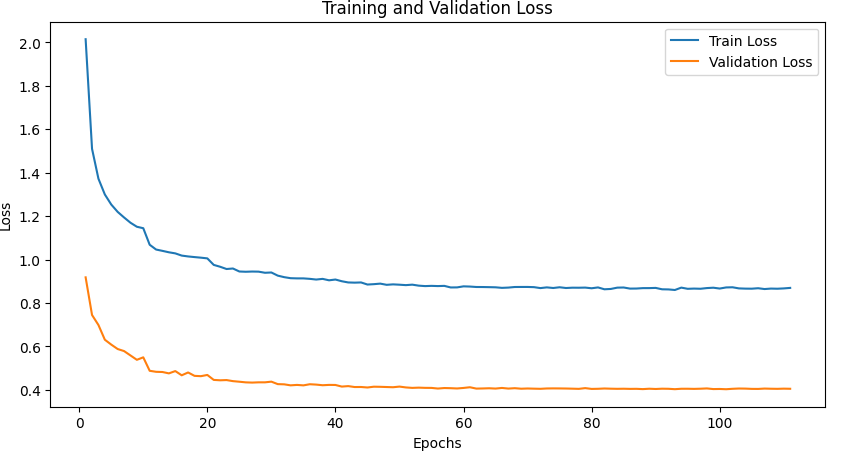
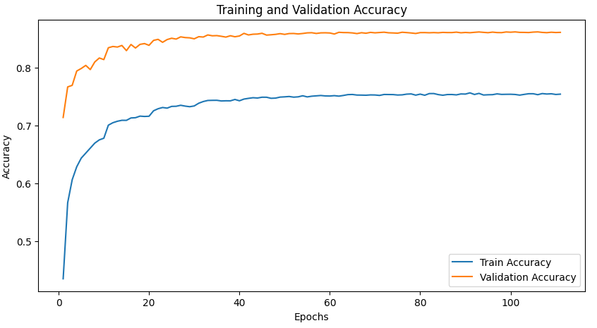
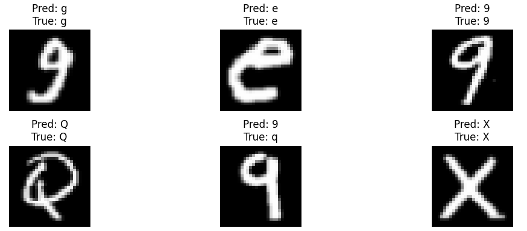

# Report of the First Assignment: Building a neural network model for classification problem

## 1 Dataset and Model Introduction

### 1.1 Dataset Introduction

The EMNIST Balanced dataset is an extension of the original MNIST dataset that includes both handwritten letters and digits. It contains 131,600 images evenly distributed across 47 classes—10 digits (0–9) and 37 uppercase and lowercase letters, excluding confusing pairs (like 'O' and '0'). Each image is 28×28 grayscale, and the dataset is designed for benchmarking character recognition models. The dataset is split into two parts: a training set with 112,800 images and a test set with 18,800 images. We will use the training set for training and 5-fold cross validation, and the test set for final evaluation. 

### 1.2 Model Introduction

We use the strategy provided in the assignment document to build up the model that obtains the best performance. We present the structure of the baseline model and the best performing model below:

  <!-- MLP 表格 -->
  

    <strong>MLP</strong>
    <table border="1" style="border-collapse: collapse; font-size: 10pt;">
      <tr><th>parameter</th><th>Baseline</th><th>Best</th></tr>
      <tr><td>Hidden layers</td><td>3</td><td>3</td></tr>
      <tr><td>Neurons/layer</td><td>128</td><td>128</td></tr>
      <tr><td>Learning rate scheduler</td><td>None (lr=0.1)</td><td>StepLR (init=0.1, step=10, γ=0.5)</td></tr>
      <tr><td>Activation function</td><td>ReLU</td><td>ELU</td></tr>
      <tr><td>Optimizer</td><td>Adam</td><td>SGD</td></tr>
      <tr><td>Batch normalization</td><td>True</td><td>True</td></tr>
      <tr><td>Regularization</td><td>L1 (1e-5)</td><td>L1 (1e-5)</td></tr>
      <tr><td>Dropout</td><td>[0.25, 0.25, 0.0]</td><td>[0.25, 0.25, 0.0]</td></tr>
    </table>
  

  <!-- CNN 表格 -->
  

    <strong>CNN</strong>
    <table border="1" style="border-collapse: collapse; font-size: 10pt;">
      <tr><th>parameter</th><th>Baseline</th><th>Best</th></tr>
      <tr><td>Convolutional layers</td><td>2</td><td>2</td></tr>
      <tr><td>Filters</td><td>[32, 64]</td><td>[32, 64]</td></tr>
      <tr><td>Kernel size</td><td>3×3</td><td>3×3</td></tr>
      <tr><td>Learning rate scheduler</td><td>None (lr=0.1)</td><td>StepLR (init=0.1, step=10, γ=0.5)</td></tr>
      <tr><td>Activation function</td><td>ReLU</td><td>ELU</td></tr>
      <tr><td>Optimizer</td><td>Adam</td><td>SGD</td></tr>
      <tr><td>Batch normalization</td><td>True</td><td>True</td></tr>
      <tr><td>Regularization</td><td>L2 (1e-5)</td><td>L1 (1e-5)</td></tr>
      <tr><td>Dropout</td><td>0.5</td><td>0.5</td></tr>
    </table>
  

  <!-- ResNet 表格 -->
  

    <strong>ResNet</strong>
    <table border="1" style="border-collapse: collapse; font-size: 10pt;">
      <tr><th>parameter</th><th>Baseline</th><th>Best</th></tr>
      <tr><td>Residual blocks</td><td>3</td><td>3</td></tr>
      <tr><td>Filters</td><td>[64, 128, 256]</td><td>[64, 128, 256]</td></tr>
      <tr><td>Learning rate scheduler</td><td>None (lr=0.1)</td><td>StepLR (init=0.1, step=10, γ=0.5)</td></tr>
      <tr><td>Activation function</td><td>ReLU</td><td>ELU</td></tr>
      <tr><td>Optimizer</td><td>Adam</td><td>SGD</td></tr>
      <tr><td>Batch normalization</td><td>True</td><td>True</td></tr>
      <tr><td>Regularization</td><td>L2 (1e-5)</td><td>L1 (1e-5)</td></tr>
      <tr><td>Dropout</td><td>0.5</td><td>0.5</td></tr>
    </table>
  

## 2 The Rationale of the Design on MLP, CNN, and ResNet

### 2.1 MLP

#### Hyper parameters and Techniques

The hyper parameters and techniques we choose to tune and explore are as follows: Number of hidden layers: 3, 4, 5; Number of neurons in each hidden layer: 32, 64, 128; Learning rate scheduler: None, StepLR, ReduceLROnPlateau; Activation function: ReLU, ELU, LeakyReLU; Optimizer: Adam, SGD, RMSprop; Batch normalization: True, False; Regularization: L1, L2, None; Dropout: True, False; Data Augmentation: True, False

These hyper parameters and techniques were selected because they are commonly used to control the capacity, convergence behavior, generalization ability, and regularization of neural networks. They directly influence how well a model learns from training data and generalizes to unseen data. By systematically varying each, we aimed to find a well-balanced configuration for optimal performance on the EMNIST dataset.

#### Effect and analysis of each hyperparameter or technique

1. **Number of Neurons in Each Hidden Layer**  
   Increasing the number of neurons from 32 to 128 led to better training and test accuracy. A larger number of neurons enhances the model’s capacity to learn complex patterns, boosting performance.

2. **Number of Hidden Layers**  
   More layers resulted in lower accuracy. Deeper networks face optimization challenges like vanishing gradients, which can lead to underfitting or poor convergence. A 3-layer network was found to be sufficient.

3. **Learning Rate Scheduler**  
   Using schedulers like StepLR or ReduceLROnPlateau significantly improved performance.StepLR, in particular, helped by allowing large updates early in training and fine-tuning later, leading to better convergence and higher final accuracy.

4. **Activation Function**  
   ELU slightly outperformed ReLU and LeakyReLU. ELU provides smoother gradients for negative inputs, which can improve learning stability and performance.

5. **Optimizer**  
   SGD performed better than Adam and RMSprop in terms of generalization. While Adam converges quickly, SGD with StepLR yielded better validation and test accuracy, likely due to its better generalization properties.

6. **Batch Normalization**  
   Enabled better accuracy across the board. It stabilizes and accelerates training by reducing internal covariate shift, leading to improved generalization.

7. **Regularization**  
   L1 regularization slightly outperformed L2 and no regularization. L1 helps enforce sparsity in weights, which can reduce overfitting and improve generalization.

8. **Dropout**  
   Improved validation and test accuracy by preventing overfitting. Even though training accuracy dropped, dropout forced the model to learn more robust features.

9. **Data Augmentation**  
   Surprisingly, it did not improve performance. The applied augmentation may have been too aggressive, increasing difficulty in learning without enough benefit, thus slightly hurting accuracy.

## 3 Results 

### 3.1 MLP
The result for each fold in 5-fold cross validation is similar, so we only show the result of the first fold.
#### 3.1.1 training loss, testing loss and testing accuracy

The accuracy of the best model on test set is 0.8614

  
  

We can see that the loss of the training set dropped rapidly in the first few rounds and then stabilized, indicating that the model has converged. The loss of the test set also dropped rapidly in the first few rounds and then stabilized, indicating that the model is not overfitting. The accuracy of the optimal model we obtained using the early stopping method on the test set is 0.8614, indicating that the model has good generalization ability. And we found that the loss of the training set is always higher than the loss of the test set. This is because we use dropout and batch normalization techniques to prevent overfitting, which will cause the model to not fully exert its capabilities during training, resulting in the loss of the training set being higher than the loss of the test set.

#### 3.1.2 The predicted results of the best model on test set

As can be seen from the figure above, the model's prediction results on the test set are relatively good. It can accurately predict most of the letters and numbers. However, for some similar letters and numbers, such as '9' and 'q', the model's prediction results are wrong. This is because these two letters and numbers are very similar in shape, and it is difficult for the model to distinguish them. This is also reasonable.

### 3.2 CNN

### 3.3 ResNet

### 3.4 Comparison of MLP, CNN, and ResNet

## Conclusions

### 张如凡 SA24011112

This project has been a valuable learning experience in understanding how different hyperparameters and training techniques impact the performance of deep learning models, particularly multilayer perceptrons (MLPs). By systematically evaluating a range of configurations, I gained deeper insights into the trade-offs between model complexity and generalization, and how elements like dropout, batch normalization, and learning rate scheduling can be strategically combined to improve robustness and performance.

One key takeaway is the importance of thorough experimentation: even small changes—such as switching the activation function from ReLU to ELU or choosing StepLR over ReduceLROnPlateau—can result in noticeable improvements. I also realized that adaptive optimizers like Adam, although fast and convenient, may not always yield the best test accuracy, especially when compared to well-tuned SGD.

If I were to redo this project, I would place greater emphasis on automating the hyperparameter search process, possibly using grid search or Bayesian optimization. Additionally, I would explore more diverse data augmentation strategies and investigate why the current augmentation approach failed to improve performance. 